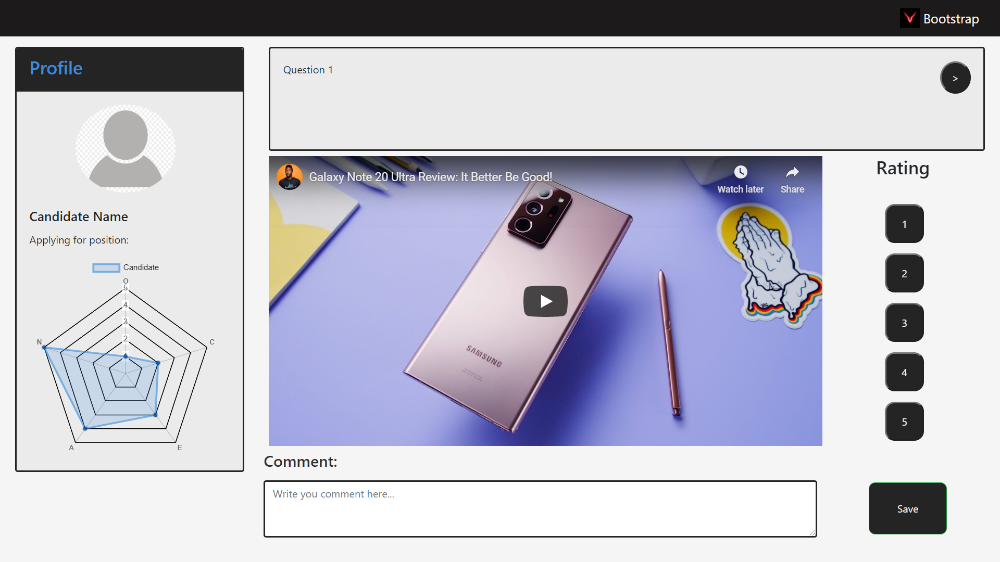

# Video-Interview-Webpage
A Video Interview Webpage designed using HTML, CSS, Javascript, Chart.js and Bootstrap

This webpage enables the interviewer to watch the video interviews and rate the candidates accordingly

The Webpage contains:
1) Candidate Profile, included with a radar chart.
2) A question box to view and go back and forth between interview questions.
3) Rating buttons from 1-5.
4) Comment box to add any comment regarding any of the questions.
5) Save button to store the comment and rating for the current question.
6) A panel to play the video interview.

## Screenshots

### Home Page

